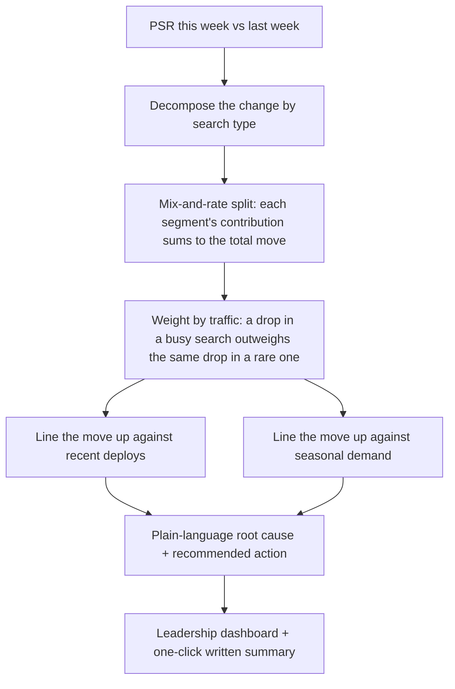

# Product Set Relevance (PSR) — Relevance Metric & Automated Root-Cause Reporting for an AI Shopping Assistant

A relevance metric for the product carousels an agentic AI assistant surfaces, plus a 0→1 system that turns week-over-week movements in that metric into an **automated, plain-language root-cause analysis** on a leadership dashboard.

> Generalized case study of work I led at Walmart on **Sparky**, Walmart's customer-facing agentic AI shopping assistant. It contains no proprietary code, data, or confidential implementation details. Every carousel, grade, and number in this repo is synthetic; public product facts are drawn from Walmart's public disclosures.

| | |
|---|---|
| **Role** | Owned the metric, the evaluation design, and the 0→1 root-cause product (Principal Product Data Analyst, Agentic AI) |
| **Partners** | Data Science, Engineering, Product, Leadership |
| **Domain** | Agentic AI, recommendation relevance, LLM evaluation, product analytics |
| **Methods** | LLM-as-a-judge, relevance grading, root-cause decomposition, human-in-the-loop calibration, metric monitoring |

---

## The problem

The assistant answers a shopping query by showing a **carousel** of recommended products. Carousel relevance is the part of the experience customers feel most directly — a carousel full of wrong-fit products is worse than no carousel — but the team had no standardized way to measure it, and no fast way to explain it when it moved.

When a weekly relevance number dipped, answering "why?" meant a manual scramble: an analyst pulled examples, cross-checked recent deploys, guessed at segments, and wrote it up days later — by which point the next week's number was already in. The metric existed; the *explanation* didn't scale.

## Goals & non-goals

**Goals**
- A single, comparable relevance metric (PSR) for carousels, trackable over time and sliceable by search type and category.
- An automated root-cause analysis: when PSR moves week over week, attribute the move to specific segments and line it up with what changed.
- A leadership-readable output — the answer, in plain language, with a recommended action.
- A trust mechanism: the automated grading is validated against human review so the reports carry a known confidence.

**Non-goals**
- Re-ranking or gating recommendations at inference time — this system measures and explains; it does not serve results.
- Replacing human judgment on safety-critical review.

## How the metric is designed

Each product in a carousel is graded **0–3** for how well it answers the query — 3 is an ideal match, 0 is irrelevant or constraint-violating. The carousel's **PSR is the mean of its product grades, rescaled to 0–100.**

Grading per product (rather than a single relevant/irrelevant flag for the whole carousel) is the key choice: it captures the common reality of a *mostly-right* carousel with one bad item, and it makes the metric sensitive to exactly the failure mode that hurts trust — a wrong-fit product sitting among good ones.

Grades come from an **LLM-as-a-judge** running at temperature 0 for reproducibility, prompted with the query, the product, and the relevant constraints (diet, size, budget, brand). The judge is **calibrated against human grades** on sampled traffic, so the automated PSR carries a measured level of agreement rather than an assumed one.

## How the root-cause analysis is designed

The 0→1 piece is the part that turned a metric into a product. When PSR moves week over week, the system:

1. **Decompose the change.** A proper mix-and-rate decomposition splits the overall week-over-week move into per-segment contributions that **sum exactly to the total** — so "PSR fell 9.7 points" becomes "substitutions account for most of it, dietary the rest, everything else flat."
2. **Weight by traffic.** The same quality drop matters more in a high-volume search, so the impact view weights each segment by how many searches it gets — surfacing where customers actually feel it.
3. **Line it up with what changed.** The move is matched against recent engineering releases (flagged suspected vs ruled out) and against seasonal demand, separating the **cause** (a deploy) from the **amplifier** (a demand peak that made the regression maximally expensive).
4. **Say it in plain language.** The output is a leadership-readable root cause and a recommended action with an expected recovery — generated automatically, not hand-written each week.

## Tradeoffs & decisions worth calling out

- **Graded 0–3, not binary.** More signal and a metric that moves with the failure mode that matters, at the cost of a harder grading task — which is precisely why the judge is calibrated.
- **Decomposition that sums to the whole.** It would have been easier to show each segment's raw change; making the contributions reconcile to the total is what makes the report trustworthy to a skeptical audience.
- **Traffic-weighting the impact, not just the score.** Ranks the *business* importance of each driver, not just its severity — the difference between "this dropped the most" and "this cost us the most."
- **Calibration before automation.** An automated root cause built on an unvalidated judge is confident and wrong. Measuring judge-vs-human agreement first is what lets the reports be trusted at all (see the `--mock` baseline in the demo, which under-detects the regression on purpose).
- **Separating cause from amplifier.** The most subtle analytical point: seasonality didn't cause the drop, but it determined how much it hurt. Conflating the two would aim the fix at the wrong thing.

## Impact

- Replaced a multi-day manual investigation with an **automated weekly root-cause analysis** leadership could read at a glance.
- Gave product and engineering a **shared, decomposable relevance metric** — debates about "did that change help or hurt?" now resolve against PSR and its breakdown.
- Tied relevance to a **business outcome** (carousel add-to-cart), so quality regressions could be prioritized by their cost, not just their size.

## What I'd build next

- **Per-deploy attribution** — automatically correlate PSR shifts to specific releases with a confidence score, rather than presenting deploys as a hand-curated suspect list.
- **Alerting on the leading edge** — fire when a *segment* breaks even if the aggregate still looks fine, since traffic-weighting can mask a sharp drop in a smaller search.
- **Judge drift monitoring** — track judge-vs-human agreement over time and re-calibrate before the automated reports quietly lose trust.
- **Category-level recovery tracking** — close the loop by confirming the recommended fix actually moved the affected segments back.

---

*All carousels, grades, and numbers in this repository are synthetic and exist only to demonstrate the design. See [`demo/`](../demo) for the runnable harness and [`app/`](../app) for the dashboard.*
